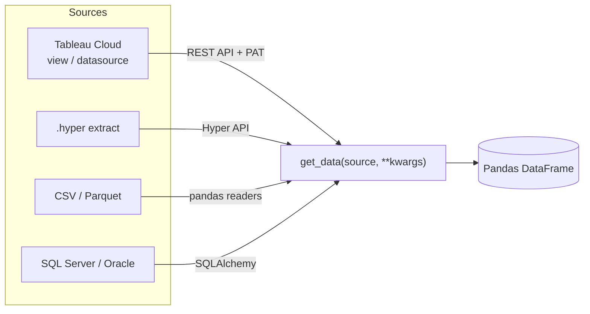

<div align="center">

# 📊 Tableau Data Pipeline

**One function. Any data source. Always a Pandas DataFrame.**

[](https://www.python.org/)
[](https://pandas.pydata.org/)
[](https://www.sqlalchemy.org/)
[](#license)

</div>

---

## Table of Contents

- [Why this exists](#why-this-exists)
- [Architecture](#architecture)
- [Quick start](#quick-start)
- [Configuration](#configuration)
- [Usage](#usage)
  - [Tableau Cloud](#1-tableau-cloud)
  - [Local Hyper extract](#2-local-hyper-extract)
  - [CSV / Parquet](#3-csv--parquet)
  - [SQL Server / Oracle](#4-sql-server--oracle)
- [API reference](#api-reference)
- [Project structure](#project-structure)
- [Security](#security)
- [Troubleshooting](#troubleshooting)
- [Extending](#extending)
- [Requirements](#requirements)
- [License](#license)

---

## Why this exists

Every data source has its own client, its own auth flow, its own quirks. `get_data()` collapses all of that into **one call site** — swap `source="..."` and everything downstream (notebooks, reports, scheduled jobs) stays identical.

```python
df = get_data(source="tableau_cloud", view_id="...", server=..., site_content_url=..., token_name=..., token_secret=...)
df = get_data(source="hyper",   path="extract.hyper")
df = get_data(source="csv",     path="data.csv")
df = get_data(source="parquet", path="data.parquet")
df = get_data(source="sql",     query="SELECT * FROM sales", conn_str="...")
```

## Architecture



| Source | Client | Auth |
|---|---|---|
| `tableau_cloud` | [`tableau_client/tableau_cloud.py`](tableau_client/tableau_cloud.py) | Personal Access Token, HTTPS only |
| `hyper` | [`tableau_client/hyper_reader.py`](tableau_client/hyper_reader.py) | — (local file) |
| `csv` / `parquet` | [`tableau_client/local_csv.py`](tableau_client/local_csv.py) | — (local file) |
| `sql` | [`tableau_client/sql_client.py`](tableau_client/sql_client.py) | SQLAlchemy connection string |

## Quick start

```bash
git clone https://github.com/Zyadsowilam/Tableau_pipline.git
cd Tableau_pipline

python -m venv venv
source venv/bin/activate        # Windows: venv\Scripts\activate

pip install -r requirements.txt
cp .env.example .env            # fill in your own values
```

## Configuration

All configuration is read from environment variables via `.env` (never commit this file — it's already `.gitignore`d). Full template: [`.env.example`](.env.example).

| Variable | Used by | Required for |
|---|---|---|
| `TABLEAU_SERVER` | `tableau_cloud.py` | Tableau Cloud (must be `https://`) |
| `TABLEAU_SITE` | `tableau_cloud.py` | Tableau Cloud |
| `TABLEAU_TOKEN_NAME` / `TABLEAU_TOKEN_SECRET` | `tableau_cloud.py` | Tableau Cloud |
| `HYPER_FILE_PATH` | `hyper_reader.py` | `hyper` source |
| `LOCAL_CSV_PATH` / `LOCAL_PARQUET_PATH` | `local_csv.py` | `csv` / `parquet` sources |
| `SQL_SERVER_CONN` | `sql_client.py` | SQL Server |
| `ORACLE_HOST`, `ORACLE_PORT`, `ORACLE_SERVICE_NAME`, `ORACLE_USERNAME`, `ORACLE_PASSWORD` | `sql_client.py`, `oracle_schema_dump.py` | Oracle |
| `ORACLE_CLIENT_LIB_DIR` | `sql_client.py` | Oracle, only if thick-mode client is needed |

## Usage

### 1. Tableau Cloud

```python
import os
from dotenv import load_dotenv
from data_pipeline import get_data

load_dotenv()

df = get_data(
    source="tableau_cloud",
    view_id="<view-id>",              # or datasource_id="<datasource-id>"
    server=os.getenv("TABLEAU_SERVER"),
    site_content_url=os.getenv("TABLEAU_SITE"),
    token_name=os.getenv("TABLEAU_TOKEN_NAME"),
    token_secret=os.getenv("TABLEAU_TOKEN_SECRET"),
)
```

- `view_id` pulls the view's **underlying data**, ignoring worksheet filters.
- `datasource_id` downloads the datasource as a `.hyper` file and reads it — pass `as_hyper=True` with `view_id` to do the same for a view.
- Sign-in is refused over plain `http://` so the access token is never sent in cleartext.

### 2. Local Hyper extract

```python
df = get_data(source="hyper", path=os.getenv("HYPER_FILE_PATH"))
```

### 3. CSV / Parquet

```python
df_csv     = get_data(source="csv",     path=os.getenv("LOCAL_CSV_PATH"))
df_parquet = get_data(source="parquet", path=os.getenv("LOCAL_PARQUET_PATH"))
```

### 4. SQL Server / Oracle

```python
df = get_data(
    source="sql",
    query="SELECT TOP 10 * FROM sales",
    conn_str=os.getenv("SQL_SERVER_CONN"),
)
```

Oracle connection strings can be built with the helper in `sql_client.py`:

```python
from tableau_client.sql_client import build_oracle_connection_string, read_sql

conn_str = build_oracle_connection_string(
    username=os.getenv("ORACLE_USERNAME"),
    password=os.getenv("ORACLE_PASSWORD"),
    host=os.getenv("ORACLE_HOST"),
    service_name=os.getenv("ORACLE_SERVICE_NAME"),
)
df = read_sql("SELECT * FROM my_table", conn_str)
```

**Bonus tool** — [`oracle_schema_dump.py`](oracle_schema_dump.py) dumps an entire Oracle schema (tables, columns, PKs, FKs) into module-grouped text files, sized for pasting into an LLM's context window:

```bash
python oracle_schema_dump.py GL AP AR
```

## API reference

```
get_data(source: str, **kwargs) -> pandas.DataFrame
```

| `source` | Required kwargs | Optional kwargs |
|---|---|---|
| `"tableau_cloud"` | `server`, `site_content_url`, `token_name`, `token_secret`, and either `view_id` or `datasource_id` | `as_hyper` (bool) |
| `"hyper"` | `path` | — |
| `"csv"` | `path` | — |
| `"parquet"` | `path` | — |
| `"sql"` | `query`, `conn_str` | — |

## Project structure

```
Tableau_pipline/
├── data_pipeline.py           # get_data() — the single entry point
├── mainExample.py             # usage example
├── oracle_schema_dump.py      # Oracle schema → LLM-friendly text dump
├── tableau_client/
│   ├── tableau_cloud.py       # Tableau Cloud REST API client
│   ├── hyper_reader.py        # local .hyper file → DataFrame
│   ├── hyper_cloud_reader.py  # in-memory .hyper bytes → DataFrame
│   ├── local_csv.py           # CSV / Parquet → DataFrame
│   └── sql_client.py          # SQL Server / Oracle → DataFrame
├── .env.example
└── requirements.txt
```

## Security

- Credentials live only in `.env` (git-ignored) — never hardcode a token, password, or connection string.
- Tableau sign-in enforces `https://`; plain HTTP is rejected before any credentials are sent.
- `oracle_schema_dump.py` uses bound parameters (`bindparam(..., expanding=True)`) for schema names — no raw string interpolation into SQL.
- Downloaded `.hyper` files are written to a private OS temp path (`tempfile.mkstemp`) and deleted immediately after being read — nothing lingers on disk.

## Troubleshooting

| Symptom | Likely cause |
|---|---|
| `ValueError: Tableau server URL must use https://` | `TABLEAU_SERVER` in `.env` is missing the scheme or uses `http://` |
| `oracledb.DatabaseError` on connect | Oracle thick-mode client not found — set `ORACLE_CLIENT_LIB_DIR` or install Instant Client |
| `FileNotFoundError` on `hyper` / `csv` / `parquet` | `path` (or the corresponding `.env` var) points to a file that doesn't exist |
| Empty DataFrame from `tableau_cloud` | View has no underlying data, or the PAT lacks permission on that view/datasource |

## Extending

Add a new source in two steps:

1. Add a reader module under `tableau_client/` that returns a `pandas.DataFrame`.
2. Add a matching `elif source == "..."` branch in `get_data()` inside [`data_pipeline.py`](data_pipeline.py).

## Requirements

- Python 3.10+
- pandas 2.0+
- Tableau Hyper API ≥ 0.0.20000
- SQLAlchemy 2.0+ (`pyodbc` for SQL Server, `oracledb` for Oracle)

Full list: [`requirements.txt`](requirements.txt)

## License

MIT
